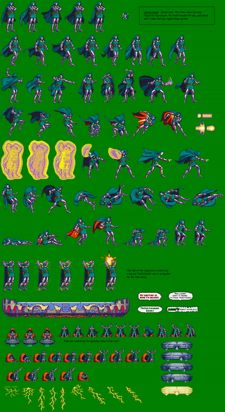

# Sprite unpack

[](https://github.com/savonarola/sprite_unpack/actions/workflows/CI.yml)

## Description

Utility script for cutting sprite sheets into sprite images. See examples section.

## Installation

```bash
pip install sprite-unpack
```

## Requirements

Python >= 3.9

## Usage

```bash
sprite-unpack -i examples/doctor-doom-sheet.png -o ./examples/result
```

## Example

I am fan of writing tiny games. Usually I use free sprite sheets for them.
This script cuts sprite sheets into separate images ready for use in
Godot, Unity, etc.

The result of cutting [doctor-doom-sheet.png](examples/doctor-doom-sheet.png)
into images can be found in [examples/result](examples/result) folder.

The algorithm is pretty straigtforward and can be easily
understood from the following recording:

.

**Caution!** The script does not handle disjoint sprites with many particles.
